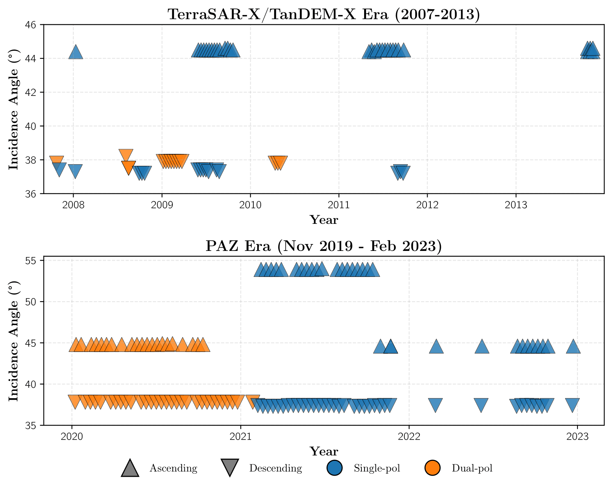

# CPAZMAL DATASET

Machine learning-ready cryospheric SAR dataset combining PAZ and TerraSAR-X/TanDEM-X acquisitions over Mont-Blanc massif glaciers (2008-2020). The dataset includes dual-polarization (HH+HV) time series with labeled glacier surface classes and integrated dataloader for deep learning applications.

## 1. Structure

```
dataset_PAZ_TSX/
├── DATASET/
│   ├── PAZTSX_CRYO_ML.hdf5          # Optimized HDF5 dataset for ML
│   └── PAZTSX_CRYO_structure.json   # Dataset structure metadata
├── script/
│   ├── load_dataset.py              # MLDatasetLoader class
│   ├── scenarios.py                 # 4 pre-configured ML scenarios
│   ├── data_processing/
│   │   ├── 1_prepare_original_data.py
│   │   └── 2_create_HDF5_dataset.py # HDF5 generation script
│   ├── utils/
│   │   ├── geo_tools.py
│   │   └── processing_utils.py
│   └── figure_generation/
└── figure/                         # Generated tables and figures
```

## 2. Installation

### Requirements

- Python ≥ 3.10
- GDAL for geospatial processing
- HDF5 libraries

### Setup

```bash
# Clone repository
git clone https://github.com/Matthieu-Gallet/dataset_PAZ_TSX.git
cd dataset_PAZ_TSX

# Create virtual environment
python -m venv venv_dataset_paz
source venv_dataset_paz/bin/activate  # or venv_dataset_paz\Scripts\activate on Windows

# Install dependencies
pip install numpy h5py rasterio pandas tqdm scikit-learn joblib
```

### Generate HDF5 Dataset
This step is required only if you want to recreate the dataset from original files (tiff), otherwise you can directly use the `PAZTSX_CRYO_ML.hdf5` file.

```bash
cd script/data_processing
python 2_create_HDF5_dataset.py
```

Output: `DATASET/PAZTSX_CRYO_ML.hdf5` (optimized for ML with chunking, compression, and pre-computed statistics)

## 3. Dataset Description

### Study Areas

The dataset covers 54 labeled areas across 7 glacier surface classes in the Mont-Blanc massif:

| Class | N  | Altitude (m)     | Slope (°)        | Aspect (°)       | Lat    | Lon   |
|-------|----|------------------|------------------|------------------|--------|-------|
| ABL   | 7  | 2566 ± 220       | 17.5 ± 4.7       | 280 ± 49         | 45.926 | 6.962 |
| ACC   | 9  | 3076 ± 405       | 26.1 ± 9.5       | 218 ± 88         | 45.916 | 6.968 |
| FOR   | 6  | 1547 ± 308       | 30.9 ± 9.1       | 254 ± 95         | 45.830 | 6.961 |
| HAG   | 7  | 3220 ± 196       | 46.5 ± 9.5       | 254 ± 117        | 45.891 | 6.928 |
| ICA   | 9  | 3379 ± 300       | 43.1 ± 14.0      | 288 ± 60         | 45.920 | 6.966 |
| PLA   | 7  | 1950 ± 354       | 16.1 ± 6.3       | 245 ± 56         | 45.940 | 6.948 |
| ROC   | 7  | 2557 ± 538       | 30.6 ± 16.7      | 154 ± 97         | 45.948 | 6.913 |

**Classes:** ABL (Ablation zone), ACC (Accumulation zone), FOR (Forefield), HAG (Hummocky ablation glacier), ICA (Ice/snow avalanche cone), PLA (Plateau glacier), ROC (Rockfall)

### Acquisition Timeline



### Data Characteristics

- **Satellites:** PAZ, TerraSAR-X, TanDEM-X
- **Polarization:** Dual-pol (HH + HV)
- **Temporal coverage:** 2008-2020
- **Resolution:** ~3m (ground range)
- **Orbit:** Ascending (ASC) and Descending (DSC)
- **Total acquisitions:** 216 SAR images across 54 groups
- **Format:** HDF5 with optimized chunking for ML

### HDF5 Structure

```
PAZTSX_CRYO_ML.hdf5
├── data/
│   ├── {group_name}/          # e.g., ABL001, ACC002
│   │   ├── ASC/               # Ascending orbit
│   │   │   ├── HH/
│   │   │   │   ├── images     # (H, W, T) - Time series
│   │   │   │   ├── masks      # (H, W, T) - Quality masks
│   │   │   │   ├── timestamps # (T,) - Acquisition dates
│   │   │   │   ├── satellites # (T,) - Satellite names
│   │   │   │   └── angles_incidence
│   │   │   └── HV/
│   │   └── DSC/               # Descending orbit
│   │       ├── HH/
│   │       └── HV/
├── metadata/
│   ├── classes                # JSON array
│   ├── satellites             # JSON array
│   └── nodata_value
└── index/
    ├── by_class/              # Fast class-based filtering
    ├── by_satellite/          # Fast satellite-based filtering
    └── temporal_ranges/       # Date range index
```

## 4. Usage

### Quick Start

```python
from load_dataset import MLDatasetLoader

# Initialize loader
loader = MLDatasetLoader('DATASET/PAZTSX_CRYO_ML.hdf5')

# Load single group data
data = loader.load_data(
    group_name='ABL001',
    orbit='ASC',
    polarisation=['HH', 'HV'],  # Dual-pol
    start_date='20200101',
    end_date='20201231',
    scale_type='amplitude'       # 'intensity', 'amplitude', 'log10'
)

# Extract windows for ML
windows, masks, positions = loader.extract_windows(
    image=data['images'],
    mask=data['masks'],
    window_size=32,
    stride=32,                   # Non-overlapping
    max_mask_value=1,            # Mask quality threshold
    max_mask_percentage=10.0,    # Max % of bad pixels
    min_valid_percentage=50.0,   # Min % of valid pixels
    skip_optim_offset=True       # Deterministic extraction
)
```

### Pre-configured Scenarios

Four ready-to-use ML scenarios are provided in `scenarios.py`:

#### Scenario 1: Temporal Stacking Classification

Multi-date classification with dual-pol temporal stacking. Suitable for random forest, SVM, or CNN-based classifiers.

```python
from scenarios import scenario_1_temporal_stacking_classification

data = scenario_1_temporal_stacking_classification(
    loader=loader,
    window_size=32,              # Patch size
    max_mask_value=1,            # Quality filter
    min_valid_percentage=50.0,   # Data validity threshold
    max_mask_percentage=10.0,
    orbit='ASC',
    start_date='20200101',
    end_date='20201231',
    scale_type='amplitude',      # Transformation: 'intensity', 'amplitude', 'log10'
    skip_optim_offset=True       # Deterministic offset
)

# Returns:
# - X: (N,) array of (window_size, window_size, T, 2) - Variable T between windows
# - y: (N,) class labels (encoded as int)
# - groups: (N,) group identifiers
# - masks, satellites, positions, class_names, group_names
```

**Parameters:**
- `window_size`: Spatial window dimension (default: 32)
- `scale_type`: Data transformation
  - `'intensity'`: Raw backscatter values
  - `'amplitude'`: Square root transformation (√intensity)
  - `'log10'`: Logarithmic scale (dB)
- `min_valid_percentage`: Minimum valid pixel ratio (0-100%)
- `max_mask_value`: Maximum accepted mask value (0-3)
- `skip_optim_offset`: If True, use fixed (0,0) offset for deterministic results

#### Scenario 2: Temporal Prediction (LSTM)

Time series prediction with train/test temporal split. Designed for LSTM, GRU, or Transformer models.

```python
from scenarios import scenario_2_temporal_prediction_lstm

data = scenario_2_temporal_prediction_lstm(
    loader=loader,
    window_size=32,
    orbit='DSC',
    polarization='HH',           # Single-pol
    train_start='20200101',
    train_end='20201031',
    predict_start='20201101',
    predict_end='20201231',
    scale_type='amplitude'
)

# Returns:
# - X_train: (N,) array of (window_size, window_size, T_train)
# - X_predict: (N,) array of (window_size, window_size, T_predict)
# - timestamps_train, timestamps_predict
```

#### Scenario 3: Cross-Polarization Domain Adaptation

Same-date HH → HV domain adaptation. Tests polarization invariance.

```python
from scenarios import scenario_3_domain_adaptation_pol

data = scenario_3_domain_adaptation_pol(
    loader=loader,
    window_size=32,
    target_date='20200804',      # Single acquisition date
    orbit='DSC'
)

# Returns:
# - X_source: (N, window_size, window_size) - HH polarization
# - X_target: (N, window_size, window_size) - HV polarization
# - y: (N,) labels
```

#### Scenario 4: Cross-Sensor Domain Adaptation

PAZ 2020 → TerraSAR-X 2008 temporal domain adaptation. Tests sensor and temporal transferability.

```python
from scenarios import scenario_4_domain_adaptation_satellite

data = scenario_4_domain_adaptation_satellite(
    loader=loader,
    window_size=32,
    source_date='20200804',      # PAZ acquisition
    target_date='20080805',      # TSX acquisition
    orbit='DSC'
)

# Returns:
# - X_source: (N_source, window_size, window_size, 2) - PAZ dual-pol
# - X_target: (N_target, window_size, window_size, 2) - TSX dual-pol
# - y_source: (N_source,) labels for PAZ (labeled)
# - groups_source, groups_target
```

### Key Features

**Deterministic Extraction:**
- `skip_optim_offset=True` allows to speed up window extraction by skipping offset optimization.
- `skip_optim_offset=False` performs offset optimization to maximize the number of valid windows, useful for small datasets.


**Scale Transformations:**
- Three options for data representation:
  - `'intensity'`: Raw backscatter
  - `'amplitude'`: Square root (√intensity)
  - `'log10'`: Logarithmic scale (dB)

**Quality Filtering:**
Information of distorted pixels is provided via quality masks (Obtained from ESA processing). 0: No distortion, 1: Layover, 2: Shadow, 3: Both
- `max_mask_value`: Rejects pixels with mask > threshold (0-3 scale)
- `max_mask_percentage`: Maximum bad pixel ratio per window with mask<=`max_mask_value`
- `min_valid_percentage`: Minimum valid data ratio per window (non-nodata and non-NaN). To avoid No Data and NaN use 100%.

### Data Loader Parameters

| Parameter              | Type         | Default    | Description                                    |
|------------------------|--------------|------------|------------------------------------------------|
| `group_name`           | str          | required   | Target area identifier (e.g., 'ABL001')        |
| `orbit`                | str          | 'DSC'      | Orbit direction: 'ASC' or 'DSC'                |
| `polarisation`         | str or list  | 'HH'       | Single ('HH'/'HV') or dual (['HH','HV'])       |
| `start_date`           | str          | None       | Start date 'YYYYMMDD'                          |
| `end_date`             | str          | None       | End date 'YYYYMMDD'                            |
| `scale_type`           | str          | 'intensity'| Transformation: 'intensity', 'amplitude', 'log10'|
| `normalize`            | bool         | False      | Apply pre-computed normalization               |
| `remove_nodata`        | bool         | True       | Replace nodata with NaN                        |
| `window_size`          | int          | 32         | Spatial window size (square)                   |
| `stride`               | int          | None       | Stride for sliding window (None = window_size) |
| `max_mask_value`       | int          | 3          | Maximum mask quality value                     |
| `max_mask_percentage`  | float        | 100.0      | Max % of pixels with mask > max_mask_value     |
| `min_valid_percentage` | float        | 50.0       | Min % of valid (non-NaN) pixels                |
| `skip_optim_offset`    | bool         | False      | Skip offset optimization for determinism       |

## 5. Citation

If you use this dataset, please cite:

```
@dataset{cpazmal2025,
  author = {},
  title = {CPAZMAL: Cryospheric PAZ and TerraSAR-X/TanDEM-X Machine Learning Dataset},
  year = {2025},
  publisher = {GitHub},
  url = {https://github.com/Matthieu-Gallet/dataset_PAZ_TSX}
}
```

## 6. License

[To be specified]

## 7. Contact

[contact information]


